  <a href="https://github.com/hazemelerefey">GitHub</a> &nbsp;&#183;&nbsp;
  <a href="https://linkedin.com/in/hazemelerefy">LinkedIn</a> &nbsp;&#183;&nbsp;
  <a href="https://twitter.com/hazemelerefy">X</a> &nbsp;&#183;&nbsp;
  <a href="https://hazemelerefy.vercel.app">Portfolio</a> &nbsp;&#183;&nbsp;
  <a href="mailto:hazemelerefy@gmail.com">Email</a>

