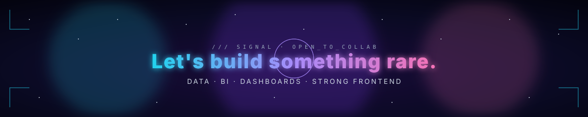

<!--
  Hazem Elerefy — Profile README
  Custom-built, animated SVG identity. Designed and assembled by hand.
  Each visual asset under /assets is a hand-authored animated SVG (SMIL + CSS).
-->

<a href="https://github.com/hazemelerefey">
  
</a>

<div align="center">

<a href="https://hazemelerefey.github.io/"></a>
<a href="https://hazemelerefey.github.io/nebula-profile/"></a>
<a href="https://linkedin.com/in/hazemelerefy"></a>
<a href="mailto:hazemawed53@gmail.com"></a>

</div>

<div align="center">
  
</div>

<p align="center">
  
  
  
</p>


## ◢ /01 · IDENTITY

```ts
const hazem = {
  role:        "Data Analyst · BI · Strong Frontend background",
  mainTrack:   "Analytics, BI, decision-ready dashboards",
  sideTrack:   "Frontend + motion (React, Three.js, Framer Motion)",
  obsessions:  ["clean data", "clear decisions", "depth", "motion", "type"],
  superpower:  "Turning numbers into something humans can actually feel.",
  currently:   "Shipping analytics by day. Building Nebula 3D for fun."
} as const;
```

I'm a **data analyst** first — my main career lives in **SQL, Power BI, and Python**,
turning operational chaos into reports leadership can act on. But I also have a
**strong frontend background** (React, TypeScript, Three.js, motion design), which
means the dashboards I build don't look or feel like default dashboards.

<table>
<tr>
<td width="50%" valign="top">

### ◢ DATA / ANALYTICS  ·  *main track*
- **SQL** · Power BI · DAX · Power Query
- **Python** · Pandas · scikit-learn (EDA, forecasting)
- KPI dashboards, executive-grade reporting
- Insight-first storytelling for non-technical readers
- Translating *what happened* → *what to do next*

</td>
<td width="50%" valign="top">

### ◢ FRONTEND / MOTION  ·  *strong background*
- React, TypeScript, Tailwind, Framer Motion
- Three.js · GLSL shaders · WebGL post-processing
- Glassmorphic, holographic, layered UI
- Micro-interactions, parallax, depth, easing taste
- Custom data viz when defaults aren't enough

</td>
</tr>
</table>


## ◢ /02 · STACK · ORBITAL VIEW

<a href="https://github.com/hazemelerefey">
  
</a>

<div align="center">

  <sub><b>DATA · BI · ANALYTICS — main track</b></sub><br/>
  
  
  
  
  
  
  
  <br/>
  <sub><b>FRONTEND · MOTION — strong background</b></sub><br/>
  
  
  
  
  
  
  <br/>
  <sub><b>3D · MOTION · DESIGN — craft layer</b></sub><br/>
  
  
  
  

</div>


## ◢ /03 · FEATURED · NEBULA PROFILE

<table>
<tr>
<td width="62%" valign="top">

<a href="https://hazemelerefey.github.io/nebula-profile/">
  
</a>

</td>
<td width="38%" valign="top">

### `Nebula 3D`
**Real-time cinematic portfolio**

My personal flex — a living 3D universe built with **Three.js**,
custom **GLSL shaders**, React, and post-processing. Glassmorphic
HUD, integrated arcade game, atmospheric particles. Built to prove
an analyst can ship a frontend that *moves*.

`Three.js` · `React` · `GLSL` · `WebGL`

[**▶ LAUNCH UNIVERSE**](https://hazemelerefey.github.io/nebula-profile/)
&nbsp;·&nbsp;
[**REPO**](https://github.com/hazemelerefey/nebula-profile)

</td>
</tr>
</table>


## ◢ /04 · SHOWCASE

<table>
<tr>
<td width="50%" valign="top">

#### [Healthcare Wait-Time Analytics →](https://github.com/hazemelerefey/analytics-healthcare-waits)
`SQL` · `Power BI` · `Power Query`

Operational analytics for waitlists, specialty demand, and bottleneck
visibility. Translates raw service data into clear planning signals
decision-makers can act on.

</td>
<td width="50%" valign="top">

#### [Customer Churn Prediction →](https://github.com/hazemelerefey/analytics-churn-prediction)
`Python` · `scikit-learn` · `Pandas`

Identifies retention risk and churn drivers from customer behavior.
Combines predictive modeling with business framing — moves from
"what happened" to "what to do next."

</td>
</tr>
<tr>
<td width="50%" valign="top">

#### [Real Estate Value Drivers →](https://github.com/hazemelerefey/analytics-realestate-drivers)
`EDA` · `Pricing analytics`

What actually drives property value? A structured exploratory analysis
that turns market noise into interpretable, comparable drivers.

</td>
<td width="50%" valign="top">

#### [Personal Portfolio →](https://hazemelerefey.github.io/)
`Frontend` · `UI / UX` · `Brand`

Where the analytics work meets the frontend craft — a presentation
layer engineered to feel as considered as the work it shows.
Proof that the *side track* still ships.

</td>
</tr>
</table>


## ◢ /05 · TELEMETRY

<div align="center">


</div>

<div align="center">

</div>

### ◢ ANALYTICS WORKBENCH · LIVE PANEL

<a href="https://github.com/hazemelerefey">
  
</a>

### ◢ ACTIVITY WAVEFORM

<div align="center">
  
</div>

### ◢ CONTRIBUTION GRID · ANIMATED

<div align="center">
  <picture>
    <source media="(prefers-color-scheme: dark)" srcset="https://raw.githubusercontent.com/hazemelerefey/hazemelerefey/output/github-contribution-grid-snake-dark.svg"/>
    <source media="(prefers-color-scheme: light)" srcset="https://raw.githubusercontent.com/hazemelerefey/hazemelerefey/output/github-contribution-grid-snake.svg"/>
    
  </picture>
</div>


## ◢ /06 · PHILOSOPHY

<table>
<tr>
<td width="33%" valign="top" align="center">

### ◇ CLARITY
The number is only useful if<br/>
someone can act on it.

</td>
<td width="33%" valign="top" align="center">

### ◆ CRAFT
A dashboard is an interface.<br/>
Frontend taste serves the data.

</td>
<td width="33%" valign="top" align="center">

### ◈ DEPTH
Motion, layering, hierarchy —<br/>
so the signal stays loud.

</td>
</tr>
</table>

```text
clean the data  ·  frame the question  ·  design the answer  ·  ship something rare
```


<a href="mailto:hazemawed53@gmail.com">
  
</a>

<div align="center">

<a href="mailto:hazemawed53@gmail.com"></a>
<a href="https://linkedin.com/in/hazemelerefy"></a>
<a href="https://hazemelerefey.github.io/"></a>

<sub><i>This README is hand-coded. Every animation above is a custom SVG —
no copy-paste, no template. If you can read between the queries,
the dashboards, and the shaders — that's the job.</i></sub>

</div>
