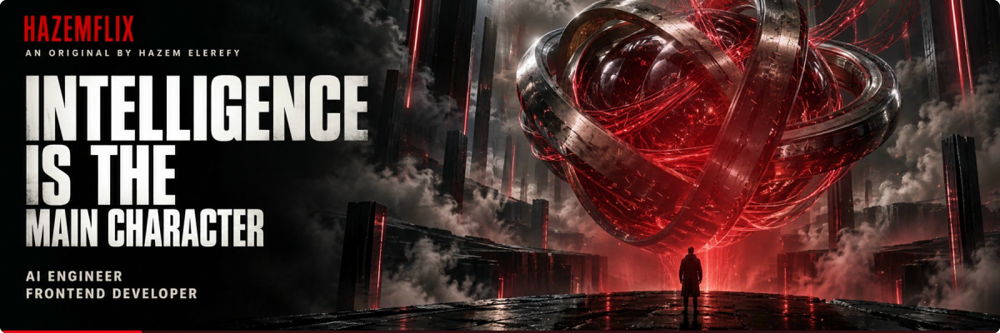
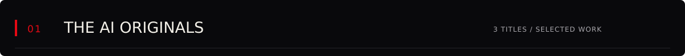
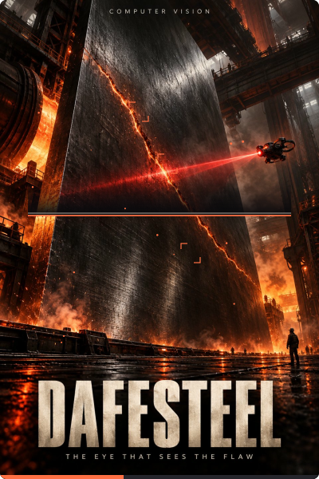
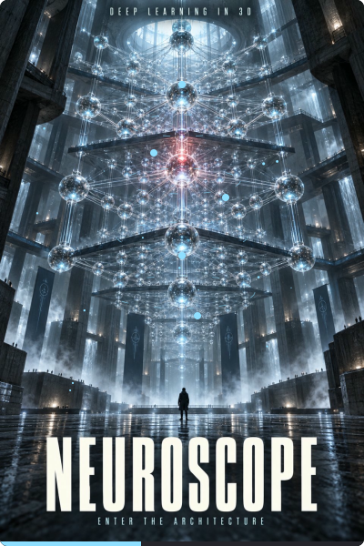
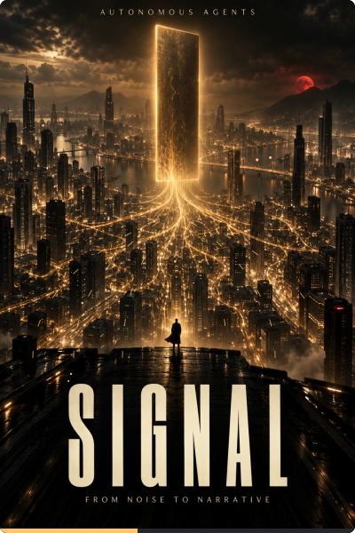
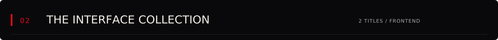
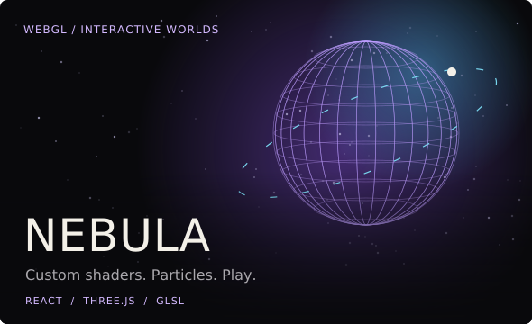
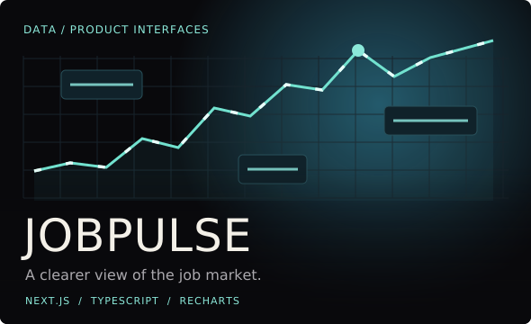
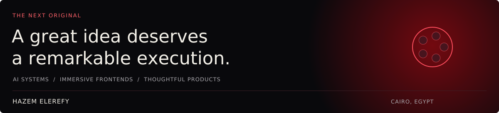

<a href="https://hazemelerefy.vercel.app"><picture><source media="(max-width: 640px)" srcset="assets/cinema/button-play-mobile.svg"></picture></a>
<a href="#the-catalog"><picture><source media="(max-width: 640px)" srcset="assets/cinema/button-catalog-mobile.svg"></picture></a>
<a href="mailto:hazemelerefy@gmail.com"><picture><source media="(max-width: 640px)" srcset="assets/cinema/button-contact-mobile.svg"></picture></a>

**I'm Hazem Elerefy, an AI engineer and frontend developer based in Cairo.** I build computer vision models, autonomous agents, and interactive web experiences, connecting the intelligence underneath with the experience people use.

<picture><source media="(max-width: 640px)" srcset="assets/cinema/section-ai-mobile.svg"></picture>

<strong>Explore the AI originals · project notes, stack &amp; demos</strong>

| Project | The story | Built with |
| :--- | :--- | :--- |
| **[DAFEsteel](https://github.com/hazemelerefey/DAFEsteel)** | Our team's steel-surface inspection system. DAFEGate adds edge and texture branches to YOLOv11n. The repository reports **81.98% mAP@0.5 on NEU-DET**, using a 70/20/10 split. [Try the model](https://huggingface.co/spaces/hazemelerefy/DAFEsteel). | Python, PyTorch, YOLO, FastAPI, Docker |
| **[NeuroScope](https://github.com/hazemelerefey/NeuroScope)** | A 3D workspace for configuring neural-network architectures, with model selection, training settings and generated code previews. | React, Three.js, React Three Fiber, Zustand, Tailwind CSS |
| **[SIGNAL / n8n projects](https://github.com/hazemelerefey/n8n-projects)** | Social-intelligence and content agents that connect discovery, processing and content generation through automated workflows. | n8n, OpenAI API, REST APIs, RSS |

<picture><source media="(max-width: 640px)" srcset="assets/cinema/section-web-mobile.svg"></picture>

<strong>Explore the interface collection · live experiences &amp; source</strong>

- **Nebula** — interactive 3D environments, custom shaders and particle systems. [Explore the source](https://github.com/hazemelerefey/nebula-profile)
- **JobPulse** — a market-intelligence interface for exploring role demand, skill trends and compensation signals. [Live dashboard](https://jobpulse-neon.vercel.app/dashboard) · [Source](https://github.com/hazemelerefey/jobpulse)
- **[Browse all repositories](https://github.com/hazemelerefey?tab=repositories)** for more frontend, analytics and automation work.

<picture><source media="(max-width: 640px)" srcset="assets/cinema/stack-mobile.svg"></picture>

<strong>Behind the scenes · background &amp; credentials</strong>

My path connects data analysis, deep learning and frontend development. I work across problem framing, data preparation, model building and the interfaces that make the result useful.

- **Applied AI & Data Analytics Diploma** — Digilians / MCIT, 2025–2026.
- **Front-End Web Development Nanodegree** — Egypt FWD / Udacity, 2020–2022.
- **Google Data Analytics Professional Certificate** — [View certificate](certificates/google%20data%20analytics.jpg).
- **[Certificates](certificates)** · **[CV](Hazem%20Elerefy%20Data/Hazem%20Elerefy%20CV.pdf)**

<a href="mailto:hazemelerefy@gmail.com"><picture><source media="(max-width: 640px)" srcset="assets/cinema/credits-mobile.svg"></picture></a>

<a href="https://linkedin.com/in/hazemelerefy"><strong>LinkedIn</strong></a> &nbsp; / &nbsp;
<a href="https://hazemelerefy.vercel.app"><strong>Portfolio</strong></a> &nbsp; / &nbsp;
<a href="mailto:hazemelerefy@gmail.com"><strong>Email</strong></a> &nbsp; / &nbsp;
<a href="https://github.com/hazemelerefey?tab=repositories"><strong>All projects</strong></a>

HAZEMFLIX · Original project key art

