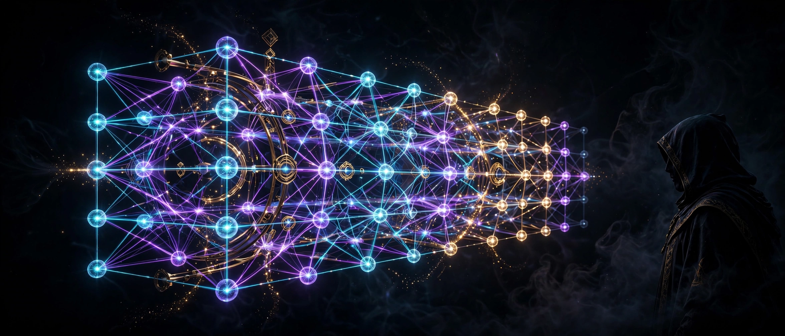
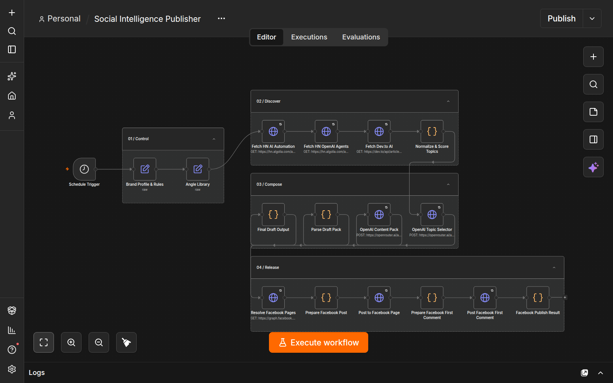
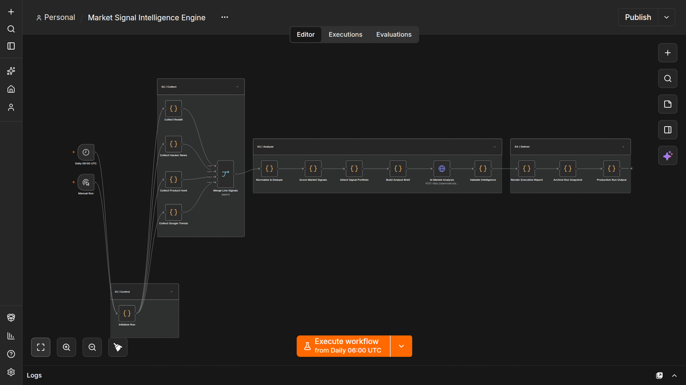

<div align="center">


</div>

## The figure in the dark

I am Hazem Elerefy, an AI engineer based in Cairo. I work where deep learning meets real products: I train models, I automate workflows, and I design the interfaces people touch. My path runs from front-end development through UI/UX and graphic design into AI, and every step still shows up in the work. I care how a thing looks, how it runs, and whether it can be trusted.

Right now I am an **AI Engineer at VO Technology**, and I am open to freelance and remote work worldwide.

```yaml
name:       Hazem Elerefy
now:        AI Engineer at VO Technology
before:     Front-End Developer, UI/UX Designer, Graphic Designer
obsessed:   computer vision, deep learning, AI automation, LLM applications
location:   Cairo, Egypt
languages:  Arabic (native), English (professional working)
```

<div align="center"></div>

## Three crafts, one loop

| Craft | What it looks like in practice |
|---|---|
| **See** | Object detection and deep learning in PyTorch and YOLO. I take models from experiment to production, not from tutorial to notebook. |
| **Automate** | n8n pipelines and LLM APIs that do real work: collecting signals, drafting content, validating output before anything ships. |
| **Design** | Interfaces and brand visuals with intent. The design years are why my demos do not look like homework. |

<div align="center"></div>

## Arsenal

<div align="center">


</div>

<div align="center"></div>

## By the numbers

<div align="center">


</div>

<div align="center"></div>

## Relics of the forge

<table>
<tr>
<td width="50%" valign="top">

### DAFEsteel

<a href="https://github.com/hazemelerefey/DAFEsteel"></a>

Steel-surface defect detector for six defect classes on NEU-DET. I led a six-person team, designed the DAFEGate enhancement for YOLOv11n, and lifted mAP@0.5 from 75.4% to 81.98% over 18 experiments. Shipped as a Dockerized FastAPI service with a live Hugging Face demo.

`PyTorch` `YOLOv11n` `FastAPI` `Docker` `Gradio`

[Code](https://github.com/hazemelerefey/DAFEsteel) · [Live demo](https://huggingface.co/spaces/hazemelerefy/DAFEsteel)

</td>
<td width="50%" valign="top">

### NeuroScope

<a href="https://github.com/hazemelerefey/NeuroScope"></a>

A 3D browser tool for arranging neural-network layers and exporting PyTorch or TensorFlow code. My design, front-end, and deep-learning sides in one project.

`React` `Three.js` `Zustand` `Tailwind CSS` `Vite`

[Code](https://github.com/hazemelerefey/NeuroScope)

</td>
</tr>
<tr>
<td width="50%" valign="top">

### Social Intelligence Publisher

<a href="https://github.com/hazemelerefey/social-intelligence-publisher"></a>

An n8n pipeline that ranks tech stories from Hacker News and Dev.to, drafts structured Arabic posts with GPT-4.1-mini, validates them, and publishes to Facebook via the Meta Graph API.

`n8n` `GPT-4.1-mini` `Meta Graph API`

[Code](https://github.com/hazemelerefey/social-intelligence-publisher)

</td>
<td width="50%" valign="top">

### Market Signal Intelligence Engine

<a href="https://github.com/hazemelerefey/market-signal-intelligence-engine"></a>

Collects signals from Reddit, Hacker News, Product Hunt, and Google Trends, deduplicates them, and writes schema-validated executive briefs with ranked themes, risks, and actions.

`n8n` `LLM APIs` `JSON Schema`

[Code](https://github.com/hazemelerefey/market-signal-intelligence-engine)

</td>
</tr>
</table>

<div align="center"></div>

## The serpent's trail

<div align="center">


<picture>
  <source media="(prefers-color-scheme: dark)" srcset="assets/azar-snake-dark.svg">
  
</picture>

*Every square the serpent devours is a day the forge was lit.*

</div>

<div align="center"></div>

## Seals and sigils

- Microsoft Certified: Power BI Data Analyst Associate (July 2026)
- Specialized Diploma in Applied AI and Data Analytics, Digilians / MCIT (September 2026)
- AI Agent Fundamentals with Azure AI Foundry, Microsoft / Coursera (July 2026)
- Generative AI: Prompt Engineering Basics, IBM / Coursera (May 2026)
- Introduction to Deep Learning and Neural Networks with Keras, IBM / Coursera (April 2026)
- Nanodegree in Front-End Web Development, Egypt FWD / Udacity (April 2022)

<div align="center"></div>

## Summon me

I am open to conversations about computer vision, applied AI, and interface design. Email is the fastest way to reach me.

<div align="center">

[](https://hazemelerefy.vercel.app)
[](https://linkedin.com/in/hazemelerefy)
[](mailto:hazemelerefy@gmail.com)

*Forged in the dark, shipped in the light.*

</div>
