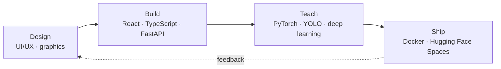
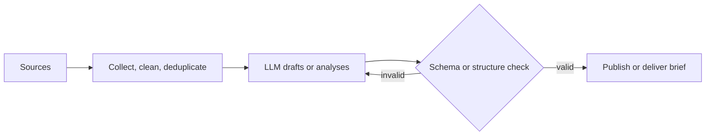

<div align="center">



</div>

## Hi, I'm Hazem

I design interfaces, build them, and now teach machines to see.
My path runs from front-end development through UI/UX and graphic design to AI engineering, and each step still shows up in how I work: I care how a thing looks, how it runs, and whether it can be trusted.
Today I'm an **AI Engineer at VO Technology**, based in Cairo.

```yaml
name:        Hazem Elerefy
now:         AI Engineer at VO Technology
before:      Front-End Developer · UI/UX Designer (freelance) · Graphic Designer (theatre group, Port Said University)
focus:       computer vision · deep learning · APIs · workflow automation
location:    Cairo, Egypt
languages:   Arabic (native), English (professional working)
```

## The training curve



Every month is an epoch. I started as a front-end developer in November 2021, took on freelance UI/UX work, designed for a university theatre group, then retrained in applied AI and data analytics in December 2025.
On 10 October 2026 I'm an AI engineer, and the design and front-end years are the reason my models don't stay in notebooks.

## Three disciplines, one loop


```mermaid
flowchart LR
    A["Design<br/>UI/UX · graphics"] --> B["Build<br/>React · TypeScript · FastAPI"]
    B --> C["Teach<br/>PyTorch · YOLO · deep learning"]
    C --> D["Ship<br/>Docker · Hugging Face Spaces"]
    D -. feedback .-> A
```

| Discipline | What it means in practice |
|---|---|
| **Design** | UI/UX design as a freelancer and poster and stage graphics for a university theatre group. I think about the person using the thing before I write code. |
| **Build** | Front-end with React, TypeScript, JavaScript, and Next.js. Back-end with FastAPI, REST APIs, SQL, and PostgreSQL. |
| **Teach machines** | Object detection, model training and evaluation in PyTorch and YOLO, and LLM-powered automation in n8n. |
| **Ship** | Docker containers, Gradio demos, and Hugging Face Spaces, so people can try the work instead of reading about it. |

## Selected work

| Project | What it is | Stack |
|---|---|---|
| [**DAFEsteel**](https://github.com/hazemelerefey/DAFEsteel) ([demo](https://huggingface.co/spaces/hazemelerefy/DAFEsteel)) | Steel-surface defect detector for six defect classes on NEU-DET. I led a six-person team through the Digilians graduation project. | PyTorch, YOLOv11n, FastAPI, Docker, Gradio |
| [**NeuroScope**](https://github.com/hazemelerefey/NeuroScope) | A 3D browser tool for arranging neural-network layers and exporting PyTorch or TensorFlow code. My design, front-end, and deep-learning sides in one project. | React, Three.js, Zustand, Tailwind CSS, Vite |
| [**Social Intelligence Publisher**](https://github.com/hazemelerefey/social-intelligence-publisher) | Ranks stories from Hacker News and Dev.to, drafts Arabic posts, validates them, and publishes to Facebook Pages with source attribution. | n8n, GPT-4.1-mini, Meta Graph API |
| [**Market Signal Intelligence Engine**](https://github.com/hazemelerefey/market-signal-intelligence-engine) | Collects signals from Reddit, Hacker News, Product Hunt, and Google Trends, deduplicates them, and writes briefs with ranked themes, risks, and actions. | n8n, LLM APIs, JSON Schema |

<details>
<summary><b>Inside DAFEsteel</b>: how the model is improved and served</summary>

<br>



I designed **DAFEGate**, an enhancement for YOLOv11n that combines learned edge features, local variance analysis, channel attention, and residual refinement.
Over 18 experiments, mAP@0.5 rose from 75.4% to 81.98% with a 2.69-million-parameter model, which I packaged as a Dockerized FastAPI service with a Hugging Face demo.

</details>

<details>
<summary><b>Inside the n8n workflows</b>: two pipelines, same rule</summary>

<br>


```mermaid
flowchart LR
    A[Sources] --> B[Collect, clean, deduplicate]
    B --> C[LLM drafts or analyses]
    C --> D{Schema or structure check}
    D -- valid --> E[Publish or deliver brief]
    D -- invalid --> C
```

In both projects an LLM's output has to pass a check before it goes anywhere. I'd rather a pipeline refuse to publish than publish something malformed.

</details>

## How I work

- **Design first, then build.** I sketch the experience before choosing the tools.
- **Measure before I claim.** Numbers come from experiments, not impressions.
- **Validate what a model says.** Output passes a check before it reaches a user.
- **Ship it.** A model nobody can open is only a file.

## Toolbox

| Area | What I use |
|---|---|
| Vision and ML | Python, PyTorch, YOLO, object detection, deep learning, model training and evaluation, scikit-learn |
| Automation and AI | n8n, LLM APIs, Meta Graph API, data ingestion, transformation, deduplication, JSON Schema validation |
| Backend and deployment | FastAPI, REST APIs, Docker, Gradio, Hugging Face Spaces |
| Front-end and design | React, TypeScript, JavaScript, Next.js, HTML, CSS, UI/UX design, graphic design |
| Data and tooling | PostgreSQL, SQL, Pandas, NumPy, Power BI, Excel, Git, Linux |

## Credentials

- Microsoft Certified: Power BI Data Analyst Associate (July 2026)
- Specialized Diploma in Applied AI and Data Analytics, Digilians / MCIT (September 2026)
- AI Agent Fundamentals with Azure AI Foundry, Microsoft / Coursera (July 2026)
- Generative AI: Prompt Engineering Basics, IBM / Coursera (May 2026)
- Introduction to Deep Learning & Neural Networks with Keras, IBM / Coursera (April 2026)
- Bachelor of Laws (LL.B.), Commercial and Corporate Law, Port Said University (June 2024)
- Nanodegree in Front-End Web Development, Egypt FWD / Udacity (April 2022)

## Get in touch

I'm open to conversations about computer vision, applied AI, and interface design. Email is the fastest way to reach me.

[Portfolio](https://hazemelerefy.vercel.app) · [LinkedIn](https://linkedin.com/in/hazemelerefy) · [Email](mailto:hazemelerefy@gmail.com)
